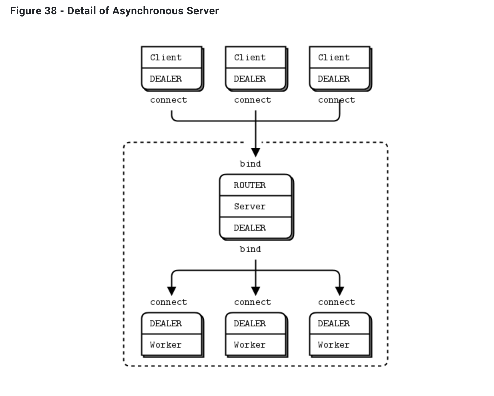

## 09-10. ZMQ DEALER ROUTER PATTERN

<br>

### 개발 결과물

- node.js의 `zeromq` 모듈을 사용하여 zmq를 사용해본다.

- 클라이언트 프로그램에서 요청을 `dealer`를 통해 요청을 보내면, 서버의 `router`가 이를 받고, 다시 서버의 `dealer`가 서버 뒤에 있거나, 서버와 같이 존재하는 워커들의 `dealer`에게 일을 보내고, 작업을 마치면 다시 반대로 클라이언트까지 돌아오는 프로그램을 만들어본다.

    

- 이때 서버 뒤의 여러개의 워커들을 동작시키기 위해 멀티 프로세싱을 이용한다.

- 멀티 프로세싱을 이용하는 이유 :

  - [스택 오버플로우 참조문서](https://stackoverflow.com/questions/40028377/is-it-possible-to-achieve-multithreading-in-nodejs)
  - Node.js 는 자체적으로 비동기처리를 지원하기 때문에 multithread로 동작하는 것과 동일하다 볼 수 있다.
  - Node.js 의 근간인 JavaScript 는 실질적인 목적을 위해 단일 쓰레드에서 동작하게된다. 따라서 멀티 쓰레드를 구현하고 싶다면 결국에는 멀티 프로세스를 구현을 해야한다.
  - 그 결과 쓰레드를 만들기 위해 프로세스를 하나 더 만들기 때문에, 다른 프로그래밍 언어에서 쓰레드를 만드는 것 보다 효율성이 떨어질 수 있다.

- 이때 서버의 `dealer` 는 연결된 워커의 수를 확인하고, 들어온 일을 이들에게 공평하게 나누어주는 것을 프로그램에서 확인할 수 있다.

  - 이것이 내부적으로 구현되어있어 사용자는 일을 분배하는 것을 구현할 필요없이, 그냥 사용만 하면 된다는 것이 큰 장점이다.

- 공식 홈페이지에 제시되어있는 여러 패턴들 중 dealer-router 패턴을 사용한다.
  ([zmq 공식 문서](https://zguide.zeromq.org/docs/chapter3/#The-Asynchronous-Client-Server-Pattern))

<br>

### 소스코드 소개

👀 코드 상의 주석으로 설명되어 있으므로 핵심이라 생각되는 것만 간략하게 소개

- 이전의 `socket` 에서는 단순하게 socket 만을 생성하고, 그것의 역할은 코드를 통해 직접 구현해야했다.

- 하지만 `zmq` 를 이용하면 다양한 패턴에 대한 소켓을 생성할 수 있고, 이미 해당 패턴에서 많이 사용하는 것들에 대한 로직 구현이 이미 되어있어 편리하다.

- 서버, 클라이언트, 워커들 사이의 zmq 소켓 사용 종류 및 연결 관계

  ```js
  /* 클라이언트 - 서버 */
  // 클라이언트는 dealer 소켓을 가지고, 서버의 router와 통신한다.
  var sock = makeASocket("dealer", clientId, frontAddr, "connect"); // 클라
  // frontserver는 router 소켓을 가지고, 클라이언트의 dealer와 통신한다.
  var frontSvr = makeASocket("router", "front", frontAddr, "bindSync"); // 서버 front

  /* 서버 - 워커 */
  // backserver는 dealer 소켓을 가지고, 워커들의 dealer와 통신한다.
  var backSvr = makeASocket("dealer", "back", backAddr, "bindSync"); // 서버 back
  // 워커는 dealer 소켓을 가지고, 서버의 dealer와 통신한다.
  var sock = makeASocket("dealer", "worker#" + workerId, backAddr, "connect"); // 워커
  ```

- 소켓에 대해 `event listener` 를 만들고, `event listener` 에 `call back` 함수를 구현하는 것은 이전의 `net` 모듈을 사용한 구현과 유사하다.

- dealer-router 패턴에서 어떤 클라이언트 소켓에서 보냈는지에 대한 정보 없이 서버와 워커가 작업한다면, 서버-워커 사이에서는 올바르게 동작을 해도, 서버 - 클라이언트 사이에서는 어떤 클라이언트 소켓에서 보냈는지 알 수 없기 때문에 문제가 생긴다. 이 때문에 send를 수행할때 `identity` 라는 항목을 추가해서 메시지를 주고 받는 것을 볼 수 있다.

  ```js
  // 서버와 워커 사이의 동작에 대해서 순서대로 호출되는 것을 나열.

  // server의 router(frontSvr)가 클라이언트의 dealer 로부터 메시지를 받았을때
  frontSvr.on("message", function () {
    var args = Array.apply(null, arguments); // 콜백함수의 파라미터로 넘어온 것을 모두 읽어올 수 있다.
    // backSvr로 메시지를 전송한다.
    // 워커와 연결되어있다.
    backSvr.send(args); // 정보를 유지하기 위해 모든 파라미터를 넘겨서 보낸다.
  });

  // 워커의 dealer에서 메시지를 보내는 부분.
  sock.on("message", function (identity, data) {
    // 어디서 보냈는지 정보를 유지하면서 데이터를 주고받기 위해 identity를 넣은 모습을 확인할 수 있다.
    sock.send([identity, data]);
  });

  // server의 dealer(backSvr)가 워커의 dealer로 부터 메시지를 받았을 때.
  backSvr.on("message", function () {
    var args = Array.apply(null, arguments); // 콜백함수의 파라미터로 넘어온 것을 모두 읽어올 수 있다.
    // frontSvr로 메시지를 전송한다.
    // 클라이언트와 연결되어있다.
    frontSvr.send(args); // 정보를 유지하기 위해 모든 파라미터를 넘겨서 보낸다.
  });
  ```

  <br>

### 데모영상 소개

- 서버 프로그램을 동작시키게되면, 동작시키면서 넘겨준 파라미터의 숫자에 따른 프로세스가 생성되고, 각 프로세스 안에서 워커가 살아난다.

- 클라이언트 프로그램을 동작시키게되면, 동작시키면서 넘겨준 클라이언트 아이디가 프로세스의 소켓 identity로 지정하면서 소켓을 생성하고, 통신이 시작된다.

- 1의 경우 : 1개의 서버, 1개의 워커 3개의 클라이언트

  - 클라이언트는 dealer를 통해 서버의 router에 메시지를 보낸다.
  - 서버는 받은 메시지를 dealer를 통해 워커에게 전달하는데, 워커가 1개 밖에 없으므로 하나의 워커에만 전달되어 worker#1 만 동작하는 것을 볼 수 있다.
  - 이후 워커는 메시지를 다시 서버에 보내고, 서버는 다시 메시지를 클라이언트에게 보내준다. 이때 identity를 이용해 보냈던 클라이언트를 찾아갈 수 있다.

- 2의 경우 : 1개의 서버, 4개의 워커, 3개의 클라이언트
  - 클라이언트는 dealer를 통해 서버의 router에 메시지를 보낸다.
  - 서버는 받은 메시지를 dealer를 통해 워커에게 전달하는데, 4개의 프로세스 위에서 각각 1개씩 워커가 돌고있으므로 총 4개의 워커가 있다. 이때 dealer가 알아서 연결된 워커들을 보고 일을 분배해준다.
  - 그 결과 실행화면을 보면 워커들이 골고루 번갈아가면서 실행되는 것을 볼 수 있다.
  - 이후 워커는 메시지를 다시 서버에 보내고, 서버는 다시 메시지를 클라이언트에게 보내준다. 이때 identity를 이용해 보냈던 클라이언트를 찾아갈 수 있다.

<br>

### 느낀점

- 확실히 zmq에는 강력한 기능을 편리하게 사용할 수 있도록 만들어진 패턴이 많아 좋다는 생각이 들었다.

- 이것을 이용하면 일을 분산해서 처리하는 서버를 구성하는데 좋을것이라 느꼈다.

<br/>

---

#### 🌛 구현한 코드의 내용에 대한 자세한 설명은 js 파일 안에 주석으로 첨부되어있습니다.

#### 🌜 따라서 핵심이라 생각되는 코드를 제외한 나머지 코드에 대한 자세한 내용은 해당 readme에서 제외하였습니다.
