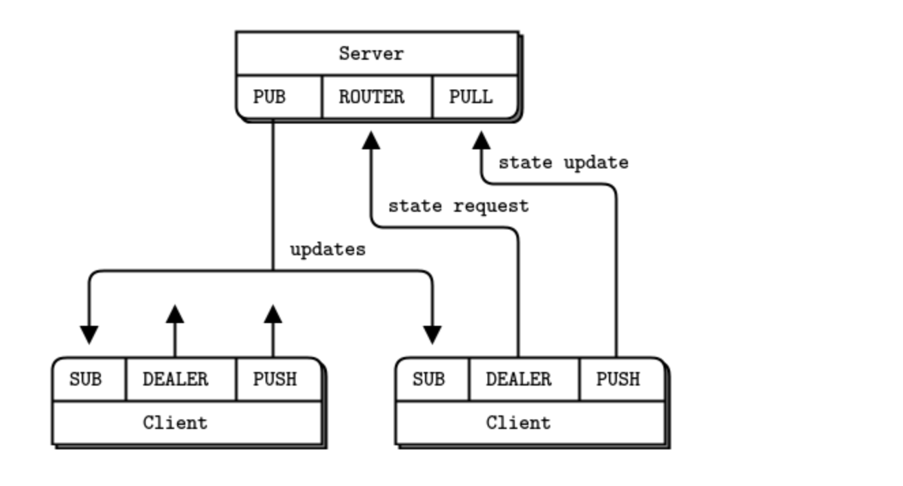

## 05-06. ZMQ PUB SUB WITH PIPELINE PATTERN

<br>

### 개발 결과물

- node.js의 `zeromq` 모듈을 사용하여 zmq를 사용해본다.

- sub-pub 구조에 push-pull 구조를 함꼐 사용하면서 pipeline pattern을 이해해본다.

    

- 클라이언트 프로그램에서 push 소켓을 통해 데이터를 push 하면 서버 프로그램에서 pull 소켓이 이를 받아서 처리한다.

- 클라이언트 프로그램은 서버 프로그램을 subscribe하고, 서버 프로그램에서 publish 하는 정보를 받는다.

<br>

### 소스코드 소개

👀 코드 상의 주석으로 설명되어 있으므로 핵심이라 생각되는 것만 간략하게 소개

- 이전의 `socket` 에서는 단순하게 socket 만을 생성하고, 그것의 역할은 코드를 통해 직접 구현해야했다.

- 하지만 `zmq` 를 이용하면 다양한 패턴에 대한 소켓을 생성할 수 있고, 이미 해당 패턴에서 많이 사용하는 것들에 대한 로직 구현이 이미 되어있어 편리하다.

  ```js
  // 정보를 당겨오는 pull을 수행할 소켓을 생성한다.
  // 서버에서 클라이언트가 push 하는 정보를 받기위해 사용
  const collector = zmq.socket("pull");

  // push 를 수행하여 정보를 publish 할 소켓을 만든다.
  // 클라이언트가 서버로 정보를 push해서 다른 프로그램들에게 메시지를 전송하기위해 사용
  const publisher = zmq.socket("push");
  ```

- 소켓에 대해 `event listener` 를 만들고, `event listener` 에 `call back` 함수를 구현하는 것은 이전의 `net` 모듈을 사용한 구현과 유사하다.

- 이전에 sub-pub 구조에서는 sub 소켓을 가진 클라이언트가 서버로 메시지를 전송하는 것이 불가능 하였지만, 여기서는 push를 이용하여 가능하다.

  ```js
  // client program
  const publisher = zmq.socket("push");
  publisher.send(randNum.toString());
  ```

- 서버에서는 클라이언트가 push 소켓을 통해 보낸 정보를 pull 소켓을 통해 받아오는 것이 가능하다.

  ```js
  const collector = zmq.socket("pull");
  collector.on("message", (data) => {
    // 수행할 작업
  });
  ```

- 주의할 사항으로 각각 서버 프로그램의 `publisher`와 `collector`를 다른 포트에 바인딩하였는데, 이를 클라이언트 프로그램에서 알맞는 소켓을 이용하여 잘 연결해주는 것이 중요하다.

  ```js
  // 서버 프로그램
  publisher.bindSync("tcp://*:5557");
  collector.bindSync("tcp://*:5558");

  // 클라이언트 프로그램
  // publisher가 동작하고 있는 address에 연결한다.
  subscriber.connect("tcp://localhost:5557");
  // collector가 동작하고 있는 address에 연결한다.
  publisher.connect("tcp://localhost:5558");
  ```

- 추가적으로 강의자료에 나온 파이썬 코드에서는 poll을 이용하여 메시지가 오기만을 기다리는 것이 아닌, 소켓에 메시지가 메시지가 왔는지 확인하고, 그렇지 않다면 랜덤변수를 생성하여 보내는 코드부분이 있었다.

  ```python
  while true :
    if subscriber.poll(100) & zmq.POLLIN:
      """ work """
    else :
      """ work """
  ```

  - 하지만 nodejs는 기본적으로 비동기적으로 동작하며, event listener들도 모두 비동기적으로 동작하기 떄문에 poll을 이용할 필요가 없다. 결론적으로 node는 기본적으로 비동기적으로 수행되기 때문에 poll을 통해서 특정 소켓에 이벤트가 있는지 확인하고 처리하는 것을 관리해줄 필요가 없다.

  <br>

### 데모영상 소개

- 클라이언트 역할을 하는 프로그램은 push socket을 통해 서버로 정보(랜덤으로 만든 숫자)를 push 하게 된다.

- 서버역할을 하는 프로그램에서 pull socket을 이용한 collector 역할을 하는 소켓을 통해 클라이언트에서 push하는 정보를 받는다.

- 서버역할을 하는 프로그램은 받은 정보를 publish 하여 이를 subscribe 하고있는 곳으로 정보를 모두 보낸다.

- 클라이언트는 시작할때 서버의 publisher를 subscribe 했기 때문에 subscriber를 통해 서버가 publish 한 정보를 받게 된다.

<br>

### 느낀점

- 이것을 이용하면 확실히 게임이나, 채팅에서 사용자의 자리비움과 같은 상태를 update 하는 것이 단순해 질 것 같다는 생각이들었다.

- 다만, 구조를 정확하게 이해하지 못하면 여러개의 소켓이 사용되기 때문에 헷갈릴수도 있다는 생각이들어, 동작방식을 잘 이해할 필요성이 있다는 생각이 들었다.

<br/>

---

#### 구현한 코드의 내용에 대한 자세한 설명은 js 파일 안에 주석으로 첨부되어있습니다.

#### 이곳에는 자세한 설명은 추가되어있지 않습니다.
