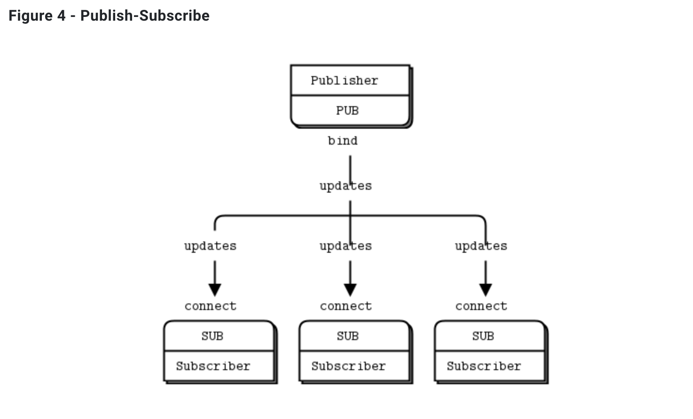

## 03-04. ZMQ PUB SUB BASIC

<br>

### 개발 결과물

- node.js의 `zeromq` 모듈을 사용하여 zmq를 사용해본다.

- 간단하게 zmq의 sub를 수행하는 프로그램을 만들고, pub를 수행하는 프로그램을 만든다.

   

- sub 프로그램에서 특정 publisher를 subscribe하면 그 pub는 메시지를 1번만 send해도 모든 subscriber가 메시지를 받는다.

- 여기서는 우편번호를 pub가 보내고 있는데, 이를 sub한 프로그램에서 pub가 1번만 보내는 구문을 수행해도, 모든 subscriber에게 가고 있다.

  - 이때 subscriber는 filter 기능을 통해 publiser가 보내는 정보 중 자신이 받고자하는 것만 선택적으로 받을 수 있다.

- 공식 홈페이지에 제시되어있는 여러 패턴들 중 기본적인 패턴인 pub-sub패턴을 사용한다.
  ([zmq 공식 문서](https://zguide.zeromq.org/docs/chapter1/#Getting-the-Message-Out))

<br>

### 소스코드 소개

👀 코드 상의 주석으로 설명되어 있으므로 핵심이라 생각되는 것만 간략하게 소개

- 이전의 `socket` 에서는 단순하게 socket 만을 생성하고, 그것의 역할은 코드를 통해 직접 구현해야했다.
- 하지만 `zmq` 를 이용하면 다양한 패턴에 대한 소켓을 생성할 수 있고, 이미 해당 패턴에서 많이 사용하는 것들에 대한 로직 구현이 이미 되어있어 편리하다.

  ```js
  // pub를 수행하기 위한 소켓을 만든다.
  const publisher = zmq.socket("pub");

  // sub를 수행하기 위한 소켓을 만든다.
  const subscriber = zmq.socket("sub");
  ```

- 소켓에 대해 `event listener` 를 만들고, `event listener` 에 `call back` 함수를 구현하는 것은 이전의 `net` 모듈을 사용한 구현과 유사하다.

- subscribe 함수를 통해 구독을 수행하여 publisher가 보내는 정보를 받을 수 있다.

  ```js
  // subscribe("topic")을 통해 subscribe를 수행한다.
  // 이떄 publisher로 부터온 문자열 중 지정해준 topic으로 시작하는 경우만 데이터를 받는다.
  // topic을 지정하고 싶지 않다면 '' 로 주게되면 publisher가 보내는 모든 정보를 받게된다.
  subscriber.subscribe(filter);
  ```

<br>

### 데모영상 소개

- 서버역할을 하고 있는 publisher에서는 우편코드에 따른 날씨를 받아와 계속해서 정보를 publish 하고 있다.

- 클라이언트 역할을 하는 subscriber에서는 publisher를 subscribe하여 publisher가 보내는 정보를 받을 수 있다.

- 이때 subscribe를 수행할때 특정 우편코드를 토픽으로 지정했는데, 이 우편코드로 시작하는 문자열 정보만 받아오게 된다.

- 클라이언트에서 총 5번 토픽에 해당하는 우편번호를 받으면 평균값을 출력하고, 클라이언트 프로그램을 종료한다.

- 서버 프로그램은 계속해서 수행되고 있다. 언제든 누군가 subscribe하면 서버에서 publish 하는 정보를 받을 수 있다.

<br>

### 느낀점

- 이전에 소켓에서는 모든 클라이언트에게 메시지를 보내려면 클라이언트 목록을 관리했어야 했다.

- 여기서는 그렇지 않고, 내부적으로 다 구현이 되어있는 sub-pub 패턴을 사용하면 간단하게 구현이 가능하여 편리했다.

- 여기까지 직접 해보니, 정말 원하는 패턴만 잘 찾으면 구현은 간단하게 할 수 있을 것 같다는 생각이 들었다.

<br/>

---

#### 🌛 구현한 코드의 내용에 대한 자세한 설명은 js 파일 안에 주석으로 첨부되어있습니다.

#### 🌜 따라서 핵심이라 생각되는 코드를 제외한 나머지 코드에 대한 자세한 내용은 해당 readme에서 제외하였습니다.
