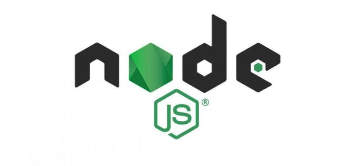

<div id="top"></div>

<br />
<div align="center">
<br / >
  <h2 align="center">2021-fullstack-netwokring-project</h2>

  <p align="center">
    강의에서 배웠던 통신기술인 socket, zmq를 node.js를 이용하여 구현해보자!!
    <br />
    <br />
  </p>
</div>

<!-- ABOUT THE PROJECT -->

## 👀 프로젝트에 대하여

해당 프로젝트는 경희대학교에서 2021-2학기 새롭게 개설된 fullstack-networking 교과목의 실습 내용을 구현한 프로젝트입니다.

수업에서는 `socket`, `http1.1`, `zmq`, `grpc`, `http2`, `webRTC`, `http3` 등의 전통적인 네트워킹 기술에서부터 최근에 나온 네트워킹 기술에 대해 학습하였습니다.

이 중 2개의 기술을 선택하여, 파이썬으로 구현된 실습 코드를 자신이 선택한 프로그래밍 언어를 사용하여 다시 구현해보는 프로젝트입니다.

<p align="right">(<a href="#top">back to top</a>)</p>

<br/>

## 🌈 선택언어 [Node.js](https://nodejs.org/)

`node.js`를 선택하게 된 이유는 프론트엔드 개발에 관심이 있어 주로 `javascript` 를 사용하여 개발을 진행해왔고, 가장 익숙하기 때문에 `javasciprt`를 기반으로 서버사이드 개발을 진행할 수 있는 플랫폼인 `node.js`를 선택하게 되었습니다.

<br/>

<div align="center">
 
</div>
<br/>
<p align="right">(<a href="#top">back to top</a>)</p>

<!-- GETTING STARTED -->
<br/>

## 🌙 선택한 Chater

Lecture_04_Socket과 Lecture_05_ZMQ 챕터 2가지를 선택하여 node.js로 구현하였습니다.

- 🥇 [Lecture_04_Socket](https://github.com/juicyorange/2021-fullstack-networking/tree/main/socket)

  - 현재 가장 많이 사용되는 http1.1은 tcp 위에서 동작하고, tcp는 socket을 사용한다.
  - 추후 프론트엔드 개발을 진행할때 http1.1을 이용한 API 호출이나, restfull 통신을 많이 수행할텐데, 이에 가장 기본이 되는 socket 챕터를 선택하게 되었다.

- 🥈 [Lecture_05_ZMQ](https://github.com/juicyorange/2021-fullstack-networking/tree/main/zmq)
  - 강의를 들으면서 다양한 패턴들에 대한 가이드가 존재하고, 이를 잘 활용하면 쉽게 원하는 구조의 통신을 구현할 수 있다는 것이 신기해서 한번 구현해보고자 선택하였다.

<p align="right">(<a href="#top">back to top</a>)</p>

<br/>

## ❄️ 예제 목록

각 예제코드 파일은 과제설명에 명시된 대로 강의자료에 있는 것과 동일한 이름을 사용했고, 그것들을 포함한 디렉토리는 내용을 함축해서 적는대신, 앞에 예제코드의 번호를 적어놓았다.

각 링크에 들어가면 코드, 코드에 대한 readme, 실행영상이 포함되어 있다.

- [SOCKET](https://github.com/juicyorange/2021-fullstack-networking/tree/main/socket)

  - [01-02. TCP ECHO](https://github.com/juicyorange/2021-fullstack-networking/tree/main/socket/01_02_tcp_echo)
  - [03-04. TCP ECHO COMPLETE](https://github.com/juicyorange/2021-fullstack-networking/tree/main/socket/03_04_tcp_echo_complete)
  - [05. TCP ECHO SOCKET SERVER](https://github.com/juicyorange/2021-fullstack-networking/tree/main/socket/05_tcp_echo_socketserver)
  - [06. TCP ECHO MULTITHREAD](https://github.com/juicyorange/2021-fullstack-networking/tree/main/socket/06_tcp_echo_multithread)
  - [07-08. TCP CHATTING](https://github.com/juicyorange/2021-fullstack-networking/tree/main/socket/07_08_tcp_chatting)
  - [09-10. UDP ECHO SERVER AND CLIENT](https://github.com/juicyorange/2021-fullstack-networking/tree/main/socket/09_10_udp_echo)
  - [11. UDP CHAT SERVER](https://github.com/juicyorange/2021-fullstack-networking/tree/main/socket/11_udp_chatting)

- [ZMQ](https://github.com/juicyorange/2021-fullstack-networking/tree/main/zmq/01_02req_rep_basic)

  - [01-02. ZMQ REP RES BASIC](https://github.com/juicyorange/2021-fullstack-networking/tree/main/zmq/01_02_req_rep_basic)
  - [03-04. ZMQ PUB SUB BASIC](https://github.com/juicyorange/2021-fullstack-networking/tree/main/zmq/03_04_pub_sub_basic)
  - [05-06. ZMQ PUB SUB WITH PIPELINE PATTERN](https://github.com/juicyorange/2021-fullstack-networking/tree/main/zmq/05_06_pub_sub_and_pull_push)
  - [07-08. ZMQ PUB SUB WITH PIPELINE PATTERN V2](https://github.com/juicyorange/2021-fullstack-networking/tree/main/zmq/07_08_pub_sub_and_pull_push_v2)
  - [09-10. ZMQ DEALER ROUTER PATTERN](https://github.com/juicyorange/2021-fullstack-networking/tree/main/zmq/09_10_dealer_router_pattern)
  - [11. ZMQ DEALER ROUTER ASYNC CLIENT](https://github.com/juicyorange/2021-fullstack-networking/tree/main/zmq/11_dealer_router_pattern_multi_thread_client)
  - [12. ZMQ DIRTY P2P](https://github.com/juicyorange/2021-fullstack-networking/tree/main/zmq/12_p2p)

<p align="right">(<a href="#top">back to top</a>)</p>

## ⚡️ 실행방법

1. 필요한 모듈을 설치해준다.

   ```sh
   npm install zeromq@5
   npm install ip
   ```

2. 각 챕터에 들어가 실행영상을 보고 동일하게 수행하면 된다.

   ```sh
   // 파일이 위치한 곳으로 이동
   cd "파일이 위치한 directory의 경로"

   // 파라미터를 받지 않는경우
   node "파일이름.js"

   // 파라미터를 받는 경우
   node "파일이름.js" arg1
   ```

<p align="right">(<a href="#top">back to top</a>)</p>

## ☃️ Contact

중간중간 저의 의견을 적어놓은 부분이 있는데 틀렸다면, 꼭 알려주세요! 감사합니다!!

[김태영] rlaxodud980909@naver.com<br>

프로젝트 링크: [https://github.com/juicyorange/2021-fullstack-networking](https://github.com/juicyorange/2021-fullstack-networking)

<p align="right">(<a href="#top">back to top</a>)</p>
