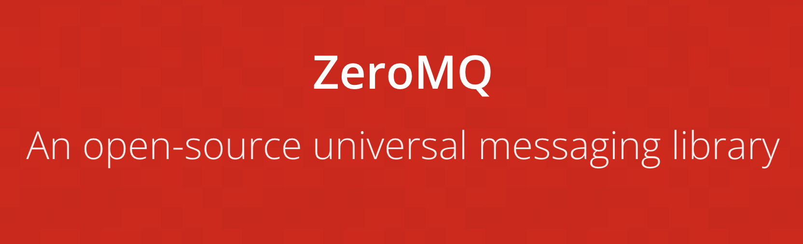
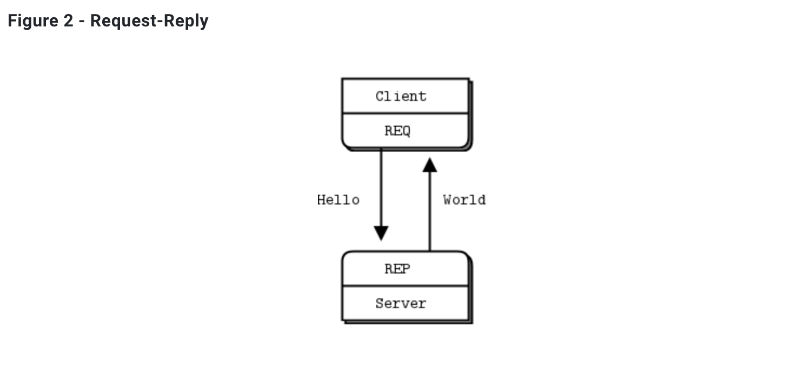

## 01-02. ZMQ REP RES BASIC

<br>

### 개발 결과물

- node.js의 `zeromq` 모듈을 사용하여 zmq를 사용해본다.

   

- 공식 홈페이지에 제시되어있는 여러 패턴들 중 가장 기본적인 패턴인 req-res패턴을 사용한다.
  ([zmq 공식 문서](https://zguide.zeromq.org/docs/chapter1/#Ask-and-Ye-Shall-Receive))

  

- 간단하게 zmq의 req를 수행하는 클라이언트 역할을 하는 프로그램이 zmq의 res를 수행하는 서버 프로그램에게 요청을 보내고, 서버 프로그램에서 응답을 보내는 구조.

<br>

### 소스코드 소개

👀 코드 상의 주석으로 설명되어 있으므로 핵심이라 생각되는 것만 간략하게 소개

- 이전의 `socket` 에서는 단순하게 socket 만을 생성하고, 그것의 역할은 코드를 통해 직접 구현해야했다.
- 하지만 `zmq` 를 이용하면 다양한 패턴에 대한 소켓을 생성할 수 있고, 이미 해당 패턴에서 많이 사용하는 것들에 대한 로직 구현이 이미 되어있어 편리하다.

  ```js
  // 응답(rep)을 위한 소켓을 만든다.
  const responder = zmq.socket("rep");

  // 요청(req)을 위한 소켓을 만든다.
  const requester = zmq.socket("req");
  ```

- 소켓에 대해 `event listener` 를 만들고, `event listener` 에 `call back` 함수를 구현하는 것은 이전의 `net` 모듈을 사용한 구현과 유사하다.

  ```js
  // event listener를 등록하고 call back 함수를 넣어줌.
  requester.on("message", (reply) => {});
  ```

<br>

### 데모영상 소개

- req를 수행하는 클라이언트 프로그램은 res를 수행하는 서버 프로그램에게 10번의 요청을 보낸다.

- res를 수행하는 서버프로그램은 요청을 받으면 1초간 멈춰있다가 요청을 보낸 req를 수행하는 클라이언트 프로그램에게 응답을 보내준다.

- 3개의 클라이언트역할의 프로그램이 동시에 수행되면, 30개의 요청이 들어가게 되고, 서버는 요청마다 1초동안 멈춰있으므로 모든 클라이언트가 응답을 받는데는 대략 30초가 걸리게 된다.

- 이때 응답을 보내는 기준은 요청이 들어온 순서가 아닌 내부적으로 랜덤하게 요청을 처리해서 준다.(수행 결과 거의 공평하게 돌아가면서 한번씩 응답을 주고있다.)

<br>

### 느낀점

- 원래같았으면 요청이 들어온 순서대로 응답을 보냈어야 하는데, 내부적으로 이를 처리해주고 있다는 것에서 매우 편리하다고 느꼈다.

<br/>

---

#### 🌛 구현한 코드의 내용에 대한 자세한 설명은 js 파일 안에 주석으로 첨부되어있습니다.

#### 🌜 따라서 핵심이라 생각되는 코드를 제외한 나머지 코드에 대한 자세한 내용은 해당 readme에서 제외하였습니다.
