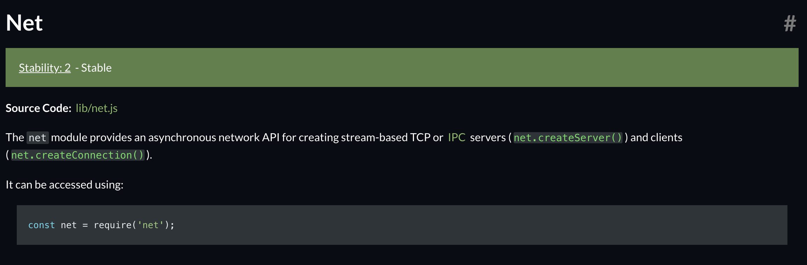

## 01-02. TCP ECHO

<br>

### 개발 결과물

- 가장 간단하게 socket tcp를 사용하여 클라이언트에서 메시지를 보내면 서버가 이를 받고, 다시 클라이언트에게 전달해주는 프로그램
- node.js에서 기본적으로 제공하는 socket tcp 모듈인 `net` 모듈을 이용하여 개발.
  - `net` 모듈은 node.js 에서 low level tcp 를 사용할 수 있도록 도와주는 모듈이다.
- 기본적으로 내장되어있는 모듈로 별도의 설치가 필요하지 않다.

  

### 소스코드 소개

👀 코드 상의 주석으로 설명되어 있으므로 핵심이라 생각되는 것만 간략하게 소개

- socket을 생성하고, socket을 통해 어떤 이벤트가 들어오면, 그 이벤트에 대한 핸들러가 수행되는 방식

  ```js
  /*--- 소켓 서버를 생성 ---*/
  // createServer의 파라미터로 연결이 들어왔을때 실행할 콜백함수를 넣어준다.
  const server = net.createServer((socket) => {});

  /*--- 소켓 생성 및 서버에 연결 - tcp는 연결하는 과정이 필수적. ---*/
  const socket = net.connect({ host, port });

  /*--- evnet listener 및 그것에 따른 event handler 등록 ---*/
  // 소켓이 성공적으로 connect 되었을때 수행되는 이벤트 핸들러.
  socket.on("connect", function () {};

  /*--- 그 외의 함수 ---*/
  // 연결된 상대 소켓으로 데이터를 전송하는 함수.
  socket.write(data);
  ```

### 데모영상 소개

- 간단하게 TCP 서버를 동작시키고, TCP 클라이언트를 동작시킨다.
- TCP 클라이언트는 실행되면서 서버에 연결요청을 수행하고, 서로 연결된다.
- TCP 클라이언트에서 메시지를 보내면 TCP 서버가 이를 받고, 이에 대해 응답을 보내준다.

### 느낀점

- TCP가 연결이 반드시 필요한 것이라는 것을 이론이 아닌 실질적으로 코딩해보면서 익힐 수 있었다.

<br>

---

#### 🌛 구현한 코드의 내용에 대한 자세한 설명은 js 파일 안에 주석으로 첨부되어있습니다.

#### 🌜 따라서 핵심이라 생각되는 코드를 제외한 나머지 코드에 대한 자세한 내용은 해당 readme에서 제외하였습니다.
