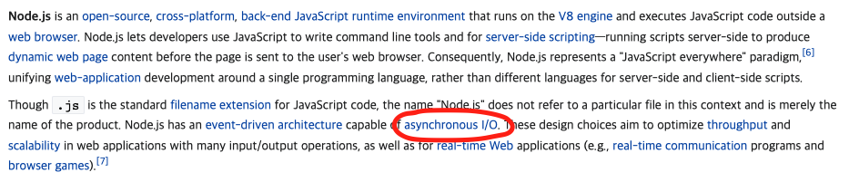

## 06. TCP ECHO SOCKET MULTITHREAD

 

### 개발 결과물

- `lec-03-prg-05-tcp-echo-server-socketserver` 와 동힐한 결과물.

- Node는 기본적으로 비동기처리방식을 지원하고있다. 따라서 비동기처리를 위한 Thread가 따로 필요하지 않다.

   

- 파이썬에서 구현된 것처럼 클라이언트 요청이 들어올때마다 서버 쓰레드(프로세스)를 만드는 것은 불가능하다.
  ([참조레퍼런스](https://stackoverflow.com/questions/40028377/is-it-possible-to-achieve-multithreading-in-nodejs))

  - node.js 는 single thread 방식으로 쓰레드를 만들려면 프로세스를 생성해야한다.

  - 이때 하나의 서버안의 `event listener` 와 같은 것들을 쓰레드로 분리하는 것이 불가능하다. ([참조할만한 내용: zmq-11-실패이유](https://github.com/juicyorange/2021-fullstack-networking/tree/main/zmq/11_dealer_router_pattern_multi_thread_client)

  - 결국에는 새로만든 쓰레드(프로세스)에서 서버를 하나 더 만들어야 하는데, 이렇게되면 프로세스가 새로 생겼기 때문에 새로운 포트에 서버를 열어야하고(기존것은 이미 사용하고 있기 때문), 이렇게 되면 클라이언트가 connect를 요청한 주소와 다른곳에가서 연결되기 때문에 문제가 생긴다.

  - 즉, node는 쓰레드를 생성하는 것이 아닌 프로세스를 생성하기 때문에 발생하는 문제이다.(쓰레드는 포트를 공유할 수 있지만, 프로세스는 불가능)

  - 따라서 구현이 불가능하다고 생각했고, 구현하지 않았다. reference를 찾아보고 고민한 끝에 내린 생각이었고, 당연히 틀릴 가능성이 높다 생각한다.

  - 결국에는 node.js 는 비동기처리를 잘 지원하기 위해서 single thread를 선택했고, 비동기처리를 하기 위해 쓰레드(프로세스)를 생성하는 것은 조금 의미가 어긋난다 생각한다.

  - 하지만 서버에 들어오는 트래픽을 분산하기위해 처음부터 여러개의 서버를 여러 쓰레드(프로세스)에 병렬적으로 띄워 요청을 분산적으로 받는것은 가능하다.

- 추가적인 기능으로는 클라이언트 풀을 관리하여 모든 연결되었던 클라이언트 연결이 끊어지면 서버가 자동으로 종료되는 기능을 구현하였다.

### 소스코드 소개

👀 코드 상의 주석으로 설명되어 있으므로 핵심이라 생각되는 것만 간략하게 소개

- 이전것과 차이가 없으므로 생략하겠다.

 

### 데모영상 소개

- 이전것과 차이가 없으므로 생략하겠다.

 

### 느낀점

- 최근에는 web 분야에만 관심이 있어 개발하다보니 비동기적인 프로그래밍이 익숙해져있었다. 이번 기회에 python의 코드를 node의 코드로 변경하면서 여러가지를 느낄 수 있었다.

- node는 애초에 서버를 운영하기 위해 나온 언어로 서버를 개발하는 것에 있어서 모듈이나, 기본적으로 비동기적으로 동작한다는 것이 python 보다 편리하였다.

- python의 코드와 node의 코드를 변경하는 과정에서 동기처리와 비동기처리에 대해 좀 더 알 수 있어서 좋은 기회였다.

 

---

#### 🌛 구현한 코드의 내용에 대한 자세한 설명은 js 파일 안에 주석으로 첨부되어있습니다.

#### 🌜 따라서 핵심이라 생각되는 코드를 제외한 나머지 코드에 대한 자세한 내용은 해당 readme에서 제외하였습니다.
