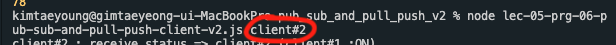

## 07-08. ZMQ PUB SUB WITH PIPELINE PATTERN V2

 

### 개발 결과물

👀 코드 상의 주석으로 설명되어 있으므로 핵심이라 생각되는 것만 간략하게 소개

- 이전의 `05-06. ZMQ PUB SUB WITH PIPELINE PATTERN`([이동](../pub_sub_and_pull_push)) 에서 가독성을 높이고자 개발

- 이전에는 client 구분 없이 막 보냈었다면, 이번에는 클라이언트 이름을 프로그램을 실행할때 파리미터로 받아서 이를 이용한다.

- 이전의 프로그램에서 크게 추가한것은 없이, 패턴의 이해를 돕기 위해 가독성을 높였다.

 

### 소스코드 소개

- 이전의 `05-06. ZMQ PUB SUB WITH PIPELINE PATTERN`([이동](../pub_sub_and_pull_push)) 와 겹치기 때문에 생략하겠다.

   

### 데모영상 소개

- 클라이언트 역할을 하는 프로그램을 실행시 터미널에서 파라미터로 클라이언트를 식별할 수 있는 문자열을 주어야한다.

  

- 클라이언트 역할을 하는 프로그램은 push socket을 통해 서버로 정보(랜덤으로 만든 숫자)를 기반으로 `activate` 또는 `deactivate` 메시지를 출력하고, 그에따라 다른 메시지를 전송한다.

- 서버역할을 하는 프로그램에서 pull socket을 이용한 collector 역할을 하는 소켓을 통해 클라이언트에서 push하는 정보를 받는다.

- 서버역할을 하는 프로그램은 받은 정보를 publish 하여 이를 subscribe 하고있는 곳으로 정보를 모두 보낸다.

- 클라이언트는 시작할때 서버의 publisher를 subscribe 했기 때문에 subscriber를 통해 서버가 publish 한 정보를 받게 된다.

 

### 느낀점

- 이 프로그램으로 보니 이해가 훨씬 쉬어서 좋았던 것 같다. 전에것은 누가 보내고, 누가 받았는지 구분이 안되서 가독성이 확실히 떨어지긴 했었다.

 

---

#### 🌛 구현한 코드의 내용에 대한 자세한 설명은 js 파일 안에 주석으로 첨부되어있습니다.

#### 🌜 따라서 핵심이라 생각되는 코드를 제외한 나머지 코드에 대한 자세한 내용은 해당 readme에서 제외하였습니다.
