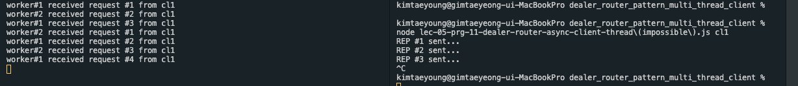
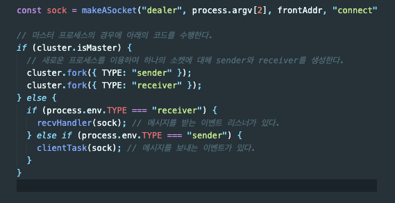

## 11. ZMQ DEALER ROUTER ASYNC CLIENT

 

### 개발 결과물

- node.js의 `zeromq` 모듈을 사용하여 zmq를 사용해본다.

- 이전 구현 파일인 `lec-05-prg-10-dealer-router-async-client.js`과 동일하게 구현하였다.

- node.js는 기본적인 처리방식이 비동기처리 방식이기 때문에, 기본적으로 쓰레드를 사용한 것처럼 동작한다. 따라서 굳이 구현할 필요없이 이미 비동기적으로 돌아간다.

- 그래도 한번 구현해보려 노력했는데, 폴더안에 `lec-05-prg-11-dealer-router-async-client-thread(impossible).js` 라는 파일이 있는데 쓰레드로 만들려다 실패한 결과이다.

- 실패 이유에 대한 생각 ([참조레퍼런스](https://stackoverflow.com/questions/40028377/is-it-possible-to-achieve-multithreading-in-nodejs))

  - 동작시켜보면 아래와 같이 메시지만 보내지고, 응답은 받지 못한다.

    

  - Node.js 는 쓰레드를 생성하지 못하기 때문에 프로세스를 새로 생성해야 한다. 그 결과 아래와 같이 작성할 수 밖에 없어진다.

    

  - 이떄 socket 연결은 프로세스의 포트를 이용하여 연결된다. 컴퓨터에서 프로세스는 유일하게 식별되야 하므로 프로세스의 포트는 모두 다르다. 그 결과 같은 소켓을 사용하더라도 메시지를 send 하는 프로세스의 포트번호와 메시지를 receive 하는 프로세스의 포트번호가 서로 달라 보낸 후에 돌아오는 프로세스에 메시지를 받는 이벤트 리스너가 없고, 다른 프로세스에 존재하여 메시지를 받지 못하는 현상이 생기는 것으로 추측된다.

  - 하지만 쓰레드의 경우에는 생성한 프로세스의 포트번호를 같이 사용하기 떄문에 가능하다. 하지만 node는 프로세스 안의 쓰레드를 구현하는 것이 불가능하다. -> single thread이기 떄문.

  - 보통 node.js 에서는 비동기처리를 지원하기 떄문에 이렇게 구현하는 경우가 드물어 관련 reference를 찾지 못하여 위에서 언급한 레퍼런스를 참조하여 나의 생각을 적어보았다. 당연히 틀릴 가능성이 높다.

 

### 소스코드 소개

👀 코드 상의 주석으로 설명되어 있으므로 핵심이라 생각되는 것만 간략하게 소개

- 이전의 것과 동일하므로 생략.

   

### 데모영상 소개

- 이전의 것과 동일하므로 생략.

 

### 느낀점

- 실패작을 구현하는 과정에서 thread와 process의 차이를 다시 한번 생각해보는 좋은 기회였던 것 같다.

- 또한 개발하려는 프로그램의 특징을 파악하고, 그것에 잘 맞는 언어를 선택하는 것도 중요하곘다라는 생각도 들었다.

 

---

#### 🌛 구현한 코드의 내용에 대한 자세한 설명은 js 파일 안에 주석으로 첨부되어있습니다.

#### 🌜 따라서 핵심이라 생각되는 코드를 제외한 나머지 코드에 대한 자세한 내용은 해당 readme에서 제외하였습니다.
